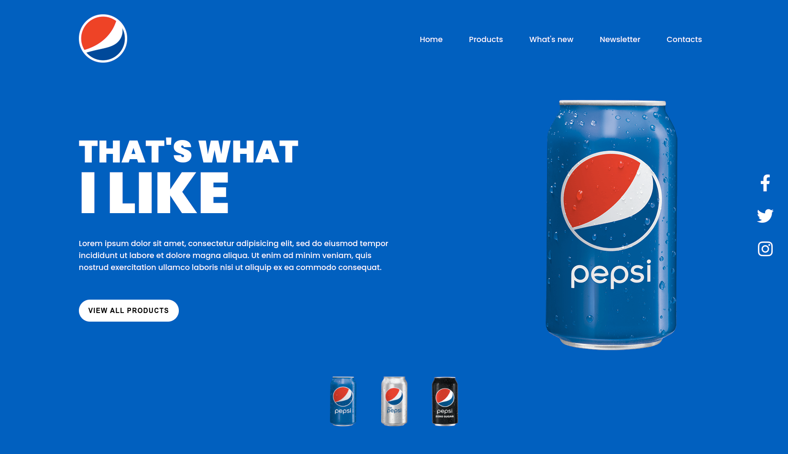

<h1 align="center">Pepsi Landing Page Design</h1>

## Table of Contents

- [Table of Contents](#table-of-contents)
- [Overview](#overview)
- [Built With](#built-with)
- [How To Use](#how-to-use)
- [Clone this repository](#clone-this-repository)
- [Acknowledgements](#acknowledgements)
- [Credit](#credit)
- [Contact](#contact)

## Overview



## Built With

-   HTML
-   CSS
-   Javascript

## How To Use

To clone and run this application, you'll need [Git](https://git-scm.com) installed on your computer. From your command line:

## Clone this repository

```bash
git clone https://github.com/saadman-galib/Pepsi-Landing-Page-Design.git
```

## Acknowledgements

-   Steps to replicate a design with only HTML and CSS
-   Using javascript for navigation bar
-   changing styles with javascript
-   changing image src with javascript

## Credit

-   This is a project from a youtube channel name Online Tutorials. I have tried to make this by myself.

## Contact

-   GitHub [@saadman-galib](https://www.github.com/saadman-galib)
-   Twitter [@GalibSaadman](https://www.twitter.com/GalibSaadman)
